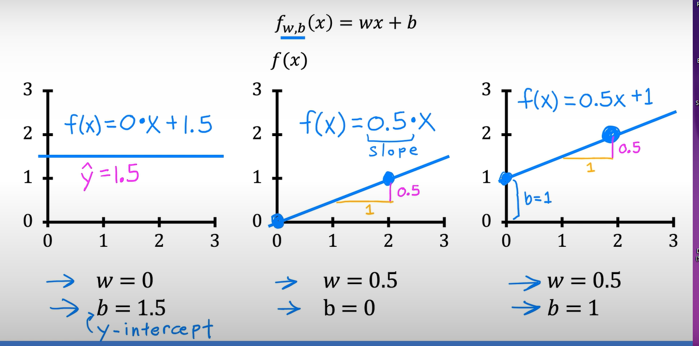
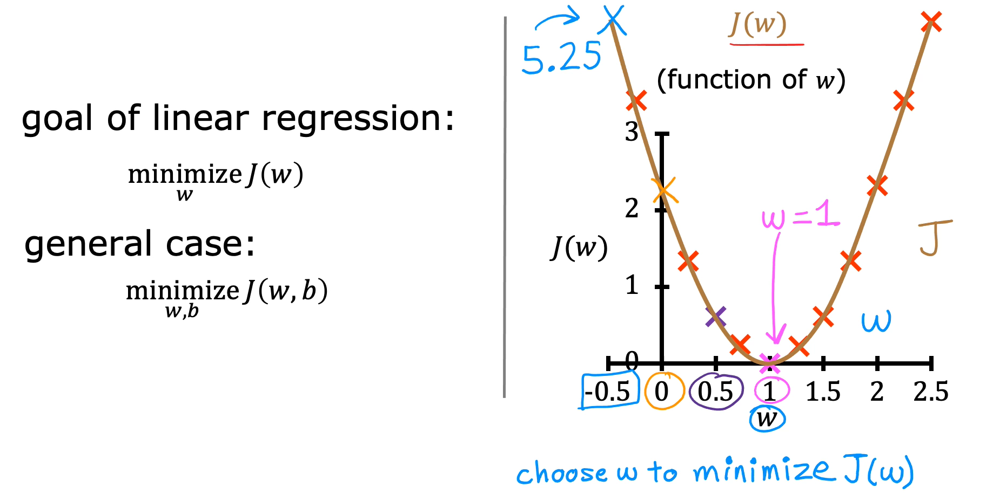

Machine Learning : Field of study that gives computer the ability to learn without being explicitly programmed (Arthur Samuel 1959)  

Machine Learning algorithms :
- Supervised Learning 
- Unsupervised learning
- Recommender systems
- Reinforcement learning

# Supervised Vs Unsupervised
## Supervised learning
> refer to algorithms that learn X-to-Y, or input-to-Output, mappings, Learn from data **labeled** with the **right answers**

the key characteristic of supervised learning is that you give your learning algorithm examples to learn from that include the **right answers** where by right answer, I mean the correct label Y for a given input X

Types :
	- Classification
	- Regression

classification :  **predict categories**, is that classification predicts a small, finite, limited set of possible output categories such as 0, 1 and 2 but not all possible numbers in between like 0,5 or 0,7 (predict categories small number of possible outputs)

Regression : predict a number infinitely many possible outputs

## **Un**supervised learning
> Data only comes with inputs x, but nut output labels y. Algorithm has to find **structure** in the data  Find something interesting in **unlabeled data**.

Types:
	- Clustering 
	- Anomaly detection
	- Dimensionality reduction 

Clustering : Group similar data points together. 

Anomaly detection: Find manual data points.

Dimensionality reduction : Compress data using fewer number.

# Regression Model

> [!Note]
> Traning set : data used to train the model

>[!note]
> Notaion :  
> x = 'input' variable feature \
> y = 'output' variable, 'targut' variable \
> m = number of training examples \
> (x,y) = singel traning example \
> ($x^{i}$,$y^{i}$) = $i^{th}$ trainig example  
> $\hat{y}$ = prediction value 

## Cost function model 

>[!IMPORTANT]
> In machine learning, parameters of a model are the variables you can adjust during traning 

> [!Note]
> parameters call also by coefficients or weights 

### cost function: Squared error cost function 
$$
{\huge
  J(w,b)  = \frac{1}{2m} \sum_{i=1}^{m} \left( \hat{y}^{(i)} - y^{(i)} \right)^2
}
$$
$$
{\huge

	J(w,b) = \frac{1}{2m} \sum_{i=1}^{m} \left(f w,b(x^{(i)}) - y^{(i)} \right )^ 2
}
$$
## the idea is find  $\hat{y}$ closer to $y^{(i)}$ for all ($x^{(i)}$ , $y^{(i)}$ ) by 

### summarization 

The goal of linear regression is to find the parameters w or w and b that results in the smallest possible value for the cost function J.

model : $\large f_{w,y} = wx + b$ 

parameter : $\large  w,b$

cost function :$\large J(w,b) = \frac{1}{2m} \sum_{i=1}^{m} \left(f w,b(x^{(i)}) - y^{(i)} \right )^ 2$

Objectives : $\large minimize_{w,b} J(w,b)$

Cost function like this 

