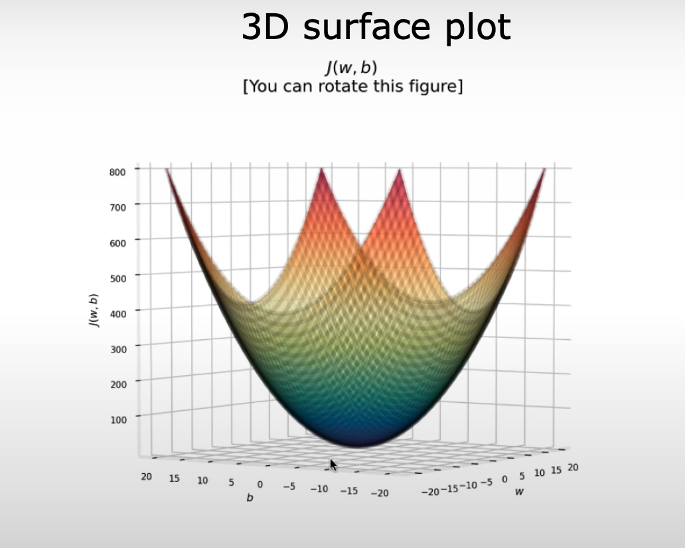

Machine Learning : Field of study that gives computer the ability to learn without being explicitly programmed (Arthur Samuel 1959)  

Machine Learning algorithms :
- Supervised Learning 
- Unsupervised learning
- Recommender systems
- Reinforcement learning

# Supervised Vs Unsupervised
## Supervised learning
> refer to algorithms that learn X-to-Y, or input-to-Output, mappings, Learn from data **labeled** with the **right answers**

the key characteristic of supervised learning is that you give your learning algorithm examples to learn from that include the **right answers** where by right answer, I mean the correct label Y for a given input X

Types :
	- Classification
	- Regression

classification :  **predict categories**, is that classification predicts a small, finite, limited set of possible output categories such as 0, 1 and 2 but not all possible numbers in between like 0,5 or 0,7 (predict categories small number of possible outputs)

Regression : predict a number infinitely many possible outputs

## **Un**supervised learning
> Data only comes with inputs x, but nut output labels y. Algorithm has to find **structure** in the data  Find something interesting in **unlabeled data**.

Types:
	- Clustering 
	- Anomaly detection
	- Dimensionality reduction 

Clustering : Group similar data points together. 

Anomaly detection: Find manual data points.

Dimensionality reduction : Compress data using fewer number.

# Regression Model

> [!Note]
> Traning set : data used to train the model

>[!note]
> Notaion :  
> x = 'input' variable feature \
> y = 'output' variable, 'targut' variable \
> m = number of training examples \
> (x,y) = singel traning example \
> ($x^{i}$,$y^{i}$) = $i^{th}$ trainig example  
> $\hat{y}$ = prediction value 

## Cost function model 

>[!IMPORTANT]
> In machine learning, parameters of a model are the variables you can adjust during traning 

> [!Note]
> parameters call also by coefficients or weights 

### cost function: Squared error cost function 
$$
{\huge
  J(w,b)  = \frac{1}{2m} \sum_{i=1}^{m} \left( \hat{y}^{(i)} - y^{(i)} \right)^2
}
$$
$$
{\huge

	J(w,b) = \frac{1}{2m} \sum_{i=1}^{m} \left(f w,b(x^{(i)}) - y^{(i)} \right )^ 2
}
$$
## the idea is find  $\hat{y}$ closer to $y^{(i)}$ for all ($x^{(i)}$ , $y^{(i)}$ ) by 

### summarization 

The goal of linear regression is to find the parameters w or w and b that results in the smallest possible value for the cost function J.

model : $\large f_{w,y} = wx + b$ 

parameter : $\large  w,b$

cost function :$\large J(w,b) = \frac{1}{2m} \sum_{i=1}^{m} \left(f w,b(x^{(i)}) - y^{(i)} \right )^ 2$

Objectives : $\large minimize_{w,b} J(w,b)$

Cost function like this 

# Gradient descent 

>[!Note]
> $\alpha$ call as the learning rate.
> the learning rate is usualla a small positive number betweenn 0 and 1, and it might be, say 0.01
> what alpha dose is , it basically controls how big of a step you take downhill.
> the choice of the learning rate alpaha will have a huge impact on the efficience of implemntaion of gradient descent.

w = $w -\alpha \frac{d}{dw} J(w,b)$
b = $b -\alpha \frac{d}{db} J(w,b)$

>[!Warning]
> Should Update w and b Simultaneously \
> *simultaniously* means that you calculate the partial derivatives for all the parameters before updating any of the parameters.
> 
>

## Learing Rate 
If $\alpha$ is too small : gradient descent may be slow, It will take a very Long time because it's going to take these tiny, tiny baby steps, and it's going to need alot of steps before it gets anywhere close to the minimum.

If $\alpha$ is too large : 
	 Gradient descent may : \
      - Overshoot, never reach minimum \
      - Fail to converge and may even diverge 

**What happens if Gradient Descent reaches a local minimum?**

What is special about a minimum?
At a local minimum of the cost function 
J(w):
- The curve is flat
- The tangent line slope(gradient) = 0
- That means: $\frac{d}{db} J(w) = 0$

If you're already at the minimum…
$$
\frac{d}{db} J(w) = 0
$$
The update becomes:
$$
w = w - \alpha \cdot 0
$$
Which simplifies to:
$$
w = w
$$
Nothing changes.

So:
Gradient descent stops automatically at a local minimum.

No special stopping command needed - math handles it.

**Why steps get smaller near the minimum (SUPER important)**
Even with a fixed learning rate α, steps shrink. Why?

Because step size =
$$
 \alpha * gradient
$$ 
| Position         | Slope (gradient) | Step size      |
| ---------------- | ---------------- | -------------- |
| Far from minimum | Large            | Big step       |
| Closer           | Medium           | Smaller step   |
| Very close       | Tiny             | Very tiny step |
| At minimum       | 0                | No step        |

So the algorithm naturally slows down.

Gradiant descent algorithm after derivative 

repeat until convergence  {	
$$
{
  w  = w - \alpha \frac{1}{m} \sum_{i=1}^{m} \left(  f_{w,b}{x^{(i)}} - y^{(i)} \right) x^{(i)}
}
$$
$$
{
  b  = b - \alpha \frac{1}{m} \sum_{i=1}^{m} \left(  f_{w,b}{x^{(i)}} - y^{(i)} \right)^2 
}
$$
}
remember : shlould update w and b simultaneously 

>[!Note]
> Global minimum : the points that has the lowest possible value for the cost function j out of all possible points.

remember : depending on where you intiialize the parameters w and b, you can end up at differnt local minima.

- when you are using a squaared error cost dunction with linear regression, the cost functin dose not and will never have multiple local minima, it has a single global minimum because of this bow shape.  
- the technical term for this is that this cost function is a convex function. 
- informally, a convex function is a bow-shaped function and it cannot have any local minima other than the single global minimum.

### "Batch" gradient descent
> "batch" : Each step of gradient descent uses all the traning exampless instead of just a subset a of the training data

