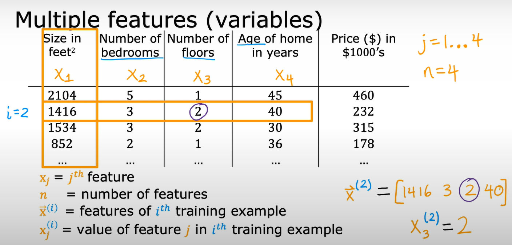
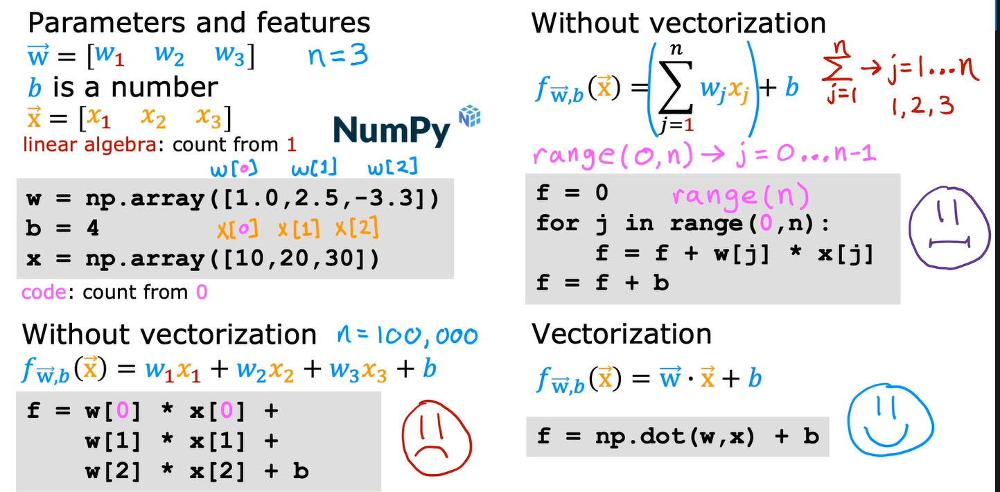

# Multiple linear regression
## Muiltable features (variables)

previously : $f_{w,b}(x) = wx+b$  
now : $f_{w,b}(x) = w_{1}x_{1} + w_{2}x_{2} +w_{3}x_{3} +w_{4}x_{4} +b$   
example :$f_{w,b}(x) = 0.1x_{1} + 4x_{2} + 10x_{3} + -2x_{4} + 80$   
$x_{1} \rArr$ feature 1  
$x_{2}\rArr$ feature 2   
$x_{3}\rArr$ feature 3   
$x_{4}\rArr$ feature 4   
80 is b $\rArr$ base price

Multiple linear regression Notations 
---
$f_{\vec {w},b}(\vec {x}) = w_{1}x_{1} + w_{2}x_{2} + ... +w_{n}x_{n} +b$  
$\vec {w} = [w_{1} w_{2} w_{3} ... w_{n}]$ parameters of the model   
b is a number   
$\vec {x} = [x_{1} x_{2} x_{3} ... x_{n}]$    
  
$f_{\vec {w},b}(\vec {x}) = \vec{w} \cdot \vec{x} + b =  w_{1}x_{1} + w_{2}x_{2} + ... +w_{n}x_{n} +b$    
$\cdot \rArr$ dot product 

>[!Note]
we add arrow up on top(vector) of x and w to signify these list of numbers (vectors)

## Vectorization  
> when you implementing a learning algorithm, using vectorization will both
> 1. make code shorter and also make it run much more efficiently.  
> 2. Take advanttage of modern numerical algebra libraries
> 3. can use GPU when write vesctorized code to help execute code more much quikly
>
> 