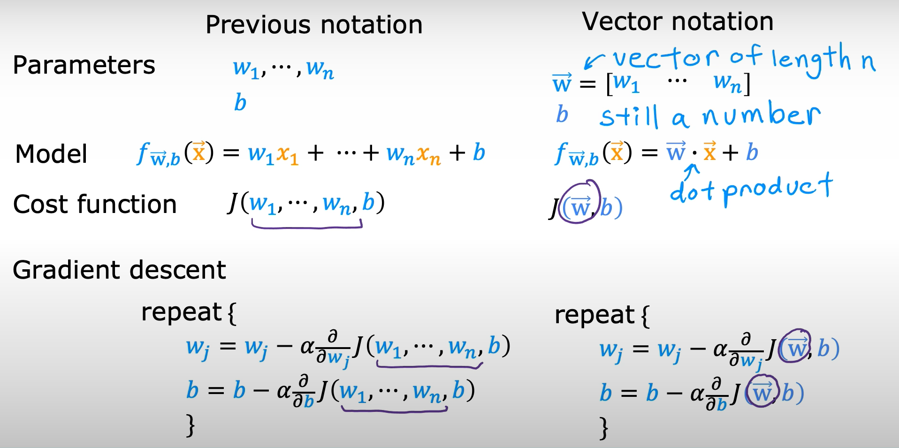

# Multiple linear regression
## Muiltable features (variables)

previously : $f_{w,b}(x) = wx+b$  
now : $f_{w,b}(x) = w_{1}x_{1} + w_{2}x_{2} +w_{3}x_{3} +w_{4}x_{4} +b$   
example :$f_{w,b}(x) = 0.1x_{1} + 4x_{2} + 10x_{3} + -2x_{4} + 80$   
$x_{1} \rArr$ feature 1  
$x_{2}\rArr$ feature 2   
$x_{3}\rArr$ feature 3   
$x_{4}\rArr$ feature 4   
80 is b $\rArr$ base price

Multiple linear regression Notations 
---
$f_{\vec {w},b}(\vec {x}) = w_{1}x_{1} + w_{2}x_{2} + ... +w_{n}x_{n} +b$  
$\vec {w} = [w_{1} w_{2} w_{3} ... w_{n}]$ parameters of the model   
b is a number   
$\vec {x} = [x_{1} x_{2} x_{3} ... x_{n}]$    
  
$f_{\vec {w},b}(\vec {x}) = \vec{w} \cdot \vec{x} + b =  w_{1}x_{1} + w_{2}x_{2} + ... +w_{n}x_{n} +b$    
$\cdot \rArr$ dot product 

>[!Note]
we add arrow up on top(vector) of x and w to signify these list of numbers (vectors)

## Vectorization  
> when you implementing a learning algorithm, using vectorization will both
> 1. make code shorter and also make it run much more efficiently.  
> 2. Take advanttage of modern numerical algebra libraries
> 3. can use GPU when write vesctorized code to help execute code more much quikly
>
> 

Previos notaion & Vector notaion 

Gradient descent : One feature & N feature

## An alternative to gradient descent
### Normal equation 
> it turns out to be possible to use an advanced linear algebra library to just solve for e and b all in one go without iterations.
- only for liner regression   
- Solve for w,b without it iterations
**Disadvantages**
- Doesn't generalize to other learning algorithm.
- Slow when number of features is larger ($> 10,000$)   
**What we need to know** 
- Normal equation method may be used in machine learning libraries that implement linear regression. 
- Gradient descnt is the recommended method for finding parameters w,b.  
**Extra note by Osama**
The **Normal Equation** is a direct mathmematical formula used in linear regression to find the best parameters without using gradient descent. 

Instead of iterating step by step, it gives you the answer in one shot.

we need to find parameters
$$
\theta =
\begin{bmatrix}
b \\
w_1 \\
w_2 \\
\vdots \\
w_n
\end{bmatrix}
$$ 
so that : 
$$
h_\theta(x) = X\theta
$$
Where : 
- X = feature matrix (with a column of 1s for bias)
- $\theta$ (theta) = parameters (weights + bias)
- y = target values
  

  
## Feature scaling
Problem Without Feature Scaling
When feature ranges are very different:

1️⃣ Cost function shape becomes distorted
The contour plot (cost vs. w₁, w₂) looks like:
Tall, skinny ellipses instead of circles.

Why?
- Small change in w₁ → big change in prediction (because x₁ is large)
- Small change in w₂ → tiny change in prediction

So the cost function is much steeper in one direction.

2️⃣ Gradient descent becomes slow 😩
Instead of going straight to the minimum, it:
- Gradient descent moves in a zigzag slow path
- The cost function becomes long and narrow (oval shape)
- Takes many small steps (Training takes longer)

Large feature values → usually need small weights  
Small feature values → usually need large weights

Solution: Feature Scaling
> Feature scaling means transforming features so they have similar ranges.

**Example:**
 Convert both features to range between 0 and 1   
**Result:**
- Cost function becomes more circular
- Gradient descent moves directly toward minimum
- Training becomes much faster

### Method One : Divide by Maximaum Value (Simple Scaling)
$$

X_{scaled} = \frac{X}{X_{max}}

$$
Example:  
If X1 range = 3 → 2000
→ Divide by 2000  
If X2 range = 0 → 5
→ Divide by 5  
**Result:**  
Features become between 0 and 1

### Method Two : Mean Normalization
> This take values ceterd around 0

$$ 
X_{normalized} = \frac{X - \mu}{X_{max} - X_{min}}
$$
Where:

- $(\mu$) = Mean (average) of the feature  
- $(X_{max}$) = Maximum value of feature  
- $(X_{min}$) = Minimum value of feature

Steps:
1. Calculate average (mean)
2. Subtract mean from each value
3. Divide by feature range

**Result:**
Values usually between -1 and 1

### Method Three : Z-Score Normalization (Most Common)

$$
X_{normalized} = \frac{X - \mu}{\sigma}
$$
Where:

- $(\mu$) = Mean of the feature  
- $(\sigma$) = Standard deviation of the feature
  
**Steps:**
1. Calculate mean
2. Calculate standard deviation
3. Normalize data

**Result:**
- Data centered around 0  
- Used widely in machine learning

### When Scalling is important
> You should scale when feature value are:
- Very large $\rArr$ like 0 to 1000 
- Very samll $\rArr$ like 0.001
- Around 100 compared to other featuers 

### Importent Note
> Feature scaling is 
- Almost always safe 
- Rarely harmful 
- Usually improves gradient descent speed 

### Final Big Picture
> Feature scaling helps machine learning models learn faster by making featuers have similar value ranges. it improves gradient descent performance and helps the model converge faster.

### Extra Helpful Formulas 
#### Mean Formula
$$
\mu = \frac{1}{n} \sum_{i=1}^{n} X_i
$$
#### Standard Deviation Formula 
> Standard deviation measures how spread out the values of a dataset are around the mean.
$$
\sigma = \sqrt{\frac{1}{n} \sum_{i=1}^{n} (X_i - \mu)^2}
$$

